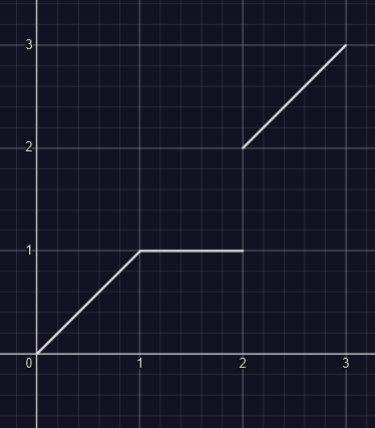
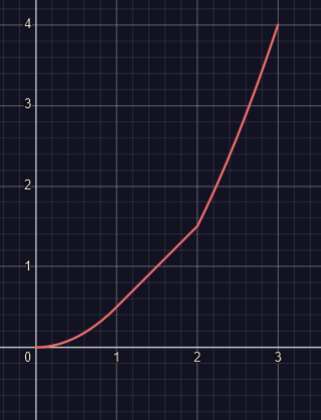

```
    Section 7.1: 11, 12
    Section 7.2: 2, 10, 16
    Section 7.3: 11, 12, 13
```

# Practice Problems 
## 7.1 What is the Riemann Integral? Glad you asked!
### Problem 11 
#### Question
Suppose that $f$ is bounded on $[a,b]$ and that there exists two sequences 
of tagged parititons on $[a,b]$ such that $||\mathcal{P}_n|| \to 0$ and
 $||\mathcal{Q}_n|| \to 0$, but such that $\lim_{n \to \infty} S(f;\mathcal{P}_n) \neq \lim_{n \to \infty} S(f;\mathcal{Q}_n)$. Show that $f$ is not Riemann integrable.
#### Solution 
Suppose for sake of contradiction that $f \in \mathcal{R}[a,b]$. Then, by the definition of Riemann integrability, there exists $L \in \mathbb{R}$ such that for all $\varepsilon > 0$ there exists $\delta_{\varepsilon} > 0$ such that if $||\mathcal{P}|| < \delta_{\varepsilon}$ and $||\mathcal{Q}|| < \delta_{\varepsilon}$ then 
$$
    |S(f;\mathcal{P}) - L| < \varepsilon/2 \quad \text{and} \quad |S(f;\mathcal{Q}) - L| < \varepsilon/2
$$
Then by the triangle inequality we see that,  
$$
    |S(f;\mathcal{P}) - S(f;\mathcal{Q})| \leq |S(f;\mathcal{P}) - L| + |S(f;\mathcal{Q}) - L| < \varepsilon
$$
Thus, we have that $S(f;\mathcal{P}) = S(f;\mathcal{Q})$ which is a contradiction. Thus, $f$ is not Riemann integrable.
### Problem 12 
#### Problem 
Let $f(x) =  x+ 1$ for $x \in \mathbb{Q}$ and $f(x) = 0$ if $x \in \mathbb{R} \setminus \mathbb{Q}$. Show that $f$ is not Riemann integrable on $[0,1]$. 
#### Solution  
Let $\dot{\mathcal{P}}$ and $\dot{\mathcal{Q}}$ be tagged partitions, defined by  
$$
\dot{\mathcal{P}} = \set{(I_i , p_i)}
\\ 
\dot{\mathcal{Q}} = \set{(I_i , q_i)} 
$$
Where $i$ ranges are integers from $0,n$, and $I_i= [x_{i+1}, x_{i}]$
$$
x_i = i/n
$$
Which satisfies $x_0 = 0$ and $x_n = 1$
and we define the tags $p_i , q_i$ as 
$$
p_i = x \in I_i \setminus \mathbb{Q}  \
( p_i \text{ is irrational} ) 
\\
q_i = x \in I_i \cap \mathbb{Q}
\ 
( q_i \text{ is rational} ) 
$$
and we know $x$ exists for every $I_i$ by the density of the reals. 
Then notice that 
$$
\sum_{i=0}^{n-1} f(p_i) (x_{i+1} - x_{i}) =  0 
$$
as $f(p_i) = 0$ as $p_i$ is irrational. 
and 
$$
\sum_{i=0}^{n-1} f(q_i) (x_{i+1} - x_{i}) = x_n - x_0 =  1 . 
$$ 
Thus by *Problem 11* We have that $f$ is not Riemann Integrable. 
## 7.2 Riemann Integrable? Aww you should'nt have <3 
### Problem 2
#### Problem 

Let $f(x) = 1$  if $x \in \mathbb{Q}$ and $f(x) = 0$ if $x \in \mathbb{R} \setminus \mathbb{Q}$. Show that $f$ is not Riemann integrable on $[0,1]$. 
#### Solution 
Let $\dot{\mathcal{P}}$ and $\dot{\mathcal{Q}}$ be tagged partitions, defined by  
$$
\dot{\mathcal{P}} = \set{(I_i , p_i)}
\\ 
\dot{\mathcal{Q}} = \set{(I_i , q_i)} 
$$
Where $i$ ranges are integers from $0,n$, and $I_i= [x_{i+1}, x_{i}]$
$$
x_i = i/n
$$
Which satisfies $x_0 = 0$ and $x_n = 1$
and we define the tags $p_i , q_i$ as 
$$
p_i = x \in I_i \setminus \mathbb{Q}  \
( p_i \text{ is irrational} ) 
\\
q_i = x \in I_i \cap \mathbb{Q}
\ 
( q_i \text{ is rational} ) 
$$
and we know $x$ exists for every $I_i$ by the density of the reals. 
Then notice that 
$$
\sum_{i=0}^{n-1} f(p_i) (x_{i+1} - x_{i}) =  0 
$$
as $f(p_i) = 0$ as $p_i$ is irrational. 
and 
$$
\sum_{i=0}^{n-1} f(q_i) (x_{i+1} - x_{i}) = x_n - x_0 =  1 . 
$$ 
Thus by *Problem 11* We have that $f$ is not Riemann Integrable. 
### Problem 10
#### Question 
if $f$ and $g$ are continuous on $[a,b]$ and if 
$\int_a^b f = \int_a^bg$. Prove that there exists $c \in [a,b]$ 
such that $f(c) = g(c)$ 
#### Solution 
Both $f$ and $g$ are riemann integrabable, and continuous on $[a,b]$.
So lets define a new function $h(x) = f(x) - g(x)$, which is also continuous on $[a,b]$. 
Then we have that, 
$$
\int_a^b h(x)dx = 0
$$
Thus because $h$ is also Riemann Integrable, we have that for every $\varepsilon > 0$
there exists a tagged partition $\dot{\mathcal{P_n}} = \{(I_i , t_i )\}$
for $i = 0,1,2, \ldots, n$ such that
$$
|\dot{\mathcal{P_n}}| < \delta_{\varepsilon}
$$ 
for $\delta_{\varepsilon} > 0$.
To make the computations easier, choose a parition such that 
$x_i = a + i(b-a)/n$ for $i = 0,1,2, \ldots, n$.
Then we have that the interval length for every partition is 
$D = (b-a)/n$. To ensure that the partition is small enough, choose 
ensure that $n > (b-a)$, then we have that $D < 1$.  
Then let $\varepsilon = DM/2$,
where 
$$M = \max ( \{h(t_1) |  ,  | h(t_2) |  , \dots , | h(t_n)|  \} )$$. 
Then we have that
$$
| S(h;\dot{\mathcal{P_n}})  - 0| < \varepsilon
$$

$$
- \varepsilon < \sum_{i=1}^{n-1}h(t_i) (x_{i+1} - x_i) < -\varepsilon \\ 
- \varepsilon< \sum_{i=1}^{n-1}h(t_i)D < \varepsilon \\ 
-  M / 2 < \sum_{i=1}^{n-1}h(t_i) < M / 2 \\ 
- M/2 < h(t_1) + h(t_2) + \dots + h(t_n) < M/2 \\
$$
Then let $h(t_k) = \max \{h(t_1) , h(t_2) , \dots , h(t_n) \}$, then we have that
$$
\frac{-M}{2} - h(t_k) < \sum_{i \neq k} h(t_i) < \frac{M}{2} - h(t_k)
$$
Then in the case where $h(t_k)$ is positive $M = h(t_k)$, thus we have that
$$
\sum_{i \neq k} h(t_i) <0 
$$
Thus we must have that there exists $t_i$ such that $h(t_i) < 0$

and in the case where $h(t_k)$ is negative $M = -h(t_k)$, thus we have that
$$
\sum_{i \neq k} h(t_i) >0
$$
therefore there must exist $t_i$ such that $h(t_i) > 0$.

In both possible cases we have shown that $h(x)$ must change sign, thus there must exist $c \in [a,b]$ such that $h(c) = 0$ and thus $f(c) = g(c)$ 
## 7.3 FTC KAGE NO JITSU!
### Problem 11  
#### Question 
Find $F'(x)$ when $F$ is defined on $[0,1]$ by 

a.
$$
    F(x) = \int_0^{x^2} ( 1 + t^3)^{-1}dt 
$$
b. 
$$
    F(x) = \int_{x^2}^{x} ( 1 + t^3)^{-1}dt 
$$
#### Solution 
##### a. 
$$
F'(x) = \frac{d}{dx} \int_0^{x^2} ( 1 + t^3)^{-1}dt = (1 + x^6)^{-1} \cdot 2x = \frac{2x}{1 + x^6}
$$
##### b. 
$$
F'(x) = \frac{d}{dx} \int_{x^2}^{x} ( 1 + t^3)^{-1}dt = 
\int_{x^2}^{1/2} ( 1 + t^3)^{-1}dt + \int_{1/2}^{x} ( 1 + t^3)^{-1}dt = \\ 
-\frac{2 \, x}{x^{6} + 1} + \frac{1}{x^{3} + 1}
$$
### Problem 12
#### Question 
$$
f(x) = 
\begin{cases} 
x & \text{for } 0 \leq x < 1, \\
1 & \text{for } 1 \leq x < 2, \\
x & \text{for } 2 \leq x \leq 3. 
\end{cases}
$$
Obtain formulas for $F(x) = \int_0^x f$ and sketch the graphs of $f$ and $F$. Where is $F$ differentiable? Evaluate $F'(x)$ at all such points.
#### Solution
$$
F(x) = 
\begin{cases}
\int _0^{x} f(t)\ dt &= \frac{1}{2} x^2& \text{for } 0 \leq x < 1, \\
\int _0^{x} f(t) \ dt &= -\frac{1}{2} + x& \text{for } 1 \leq x < 2, \\
\int _0^{x} f(t) \ dt &= \frac{1}{2}(x^2 -1) & \text{for } 2 \leq x \leq 3. 
\end{cases}
$$
$F(x)$ is differentiable where $f$ is continuous, thus $F$ is differentiable on $[0,2)$ and $(2,3)$. 
The following is a figure of f 
 


The following is a figure of $F$




We have that $F'(x) = f(x)$ for $x \in [0,2)$ and $(2,3)$
### Problem 13 
The function $g$ is defined on $[0, 3]$ by 
$$
g(x) = 
\begin{cases} 
-1 & \text{for } 0 \leq x < 2, \\
1 & \text{for } 2 \leq x \leq 3. 
\end{cases}
$$

Find the indefinite integral $G(x) = \int_0^x g$ for $0 \leq x \leq 3$, and sketch the graphs of $g$ and $G$. Does $G'(x) = g(x)$ for all $x$ in $[0, 3]$?

#### Solution

$$
G(x) = 
\begin{cases}
\int g(x) \ dx &= -x & \text{for } 0 \leq x < 2, \\
\int g(x) \ dx &= -2 + x & \text{for } 2 \leq x \leq 3.
\end{cases}
$$
$$
G'(x) = g(x) \text{ for } x \in [0,2) \text{ and } (2,3). 
$$
The following is a figure of $g$

just imagine it bruh 

The following is a figure of $G$

just imagine it bruh 
